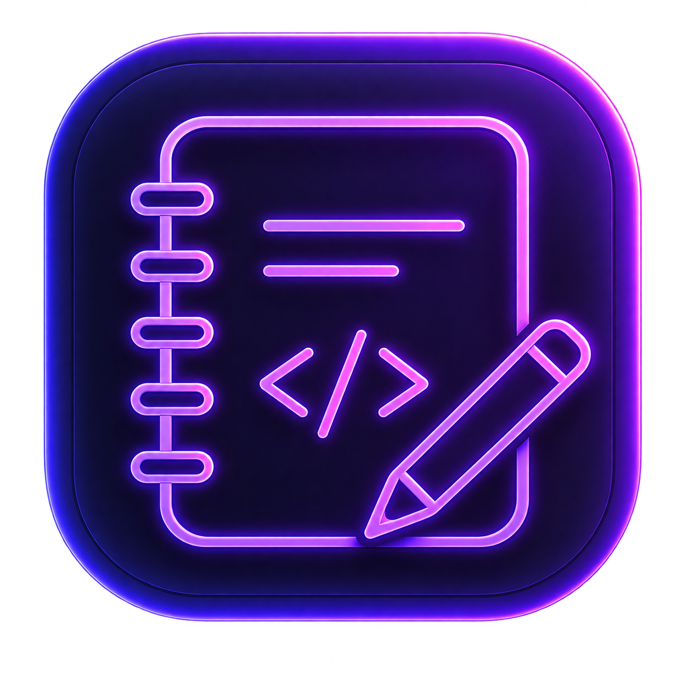
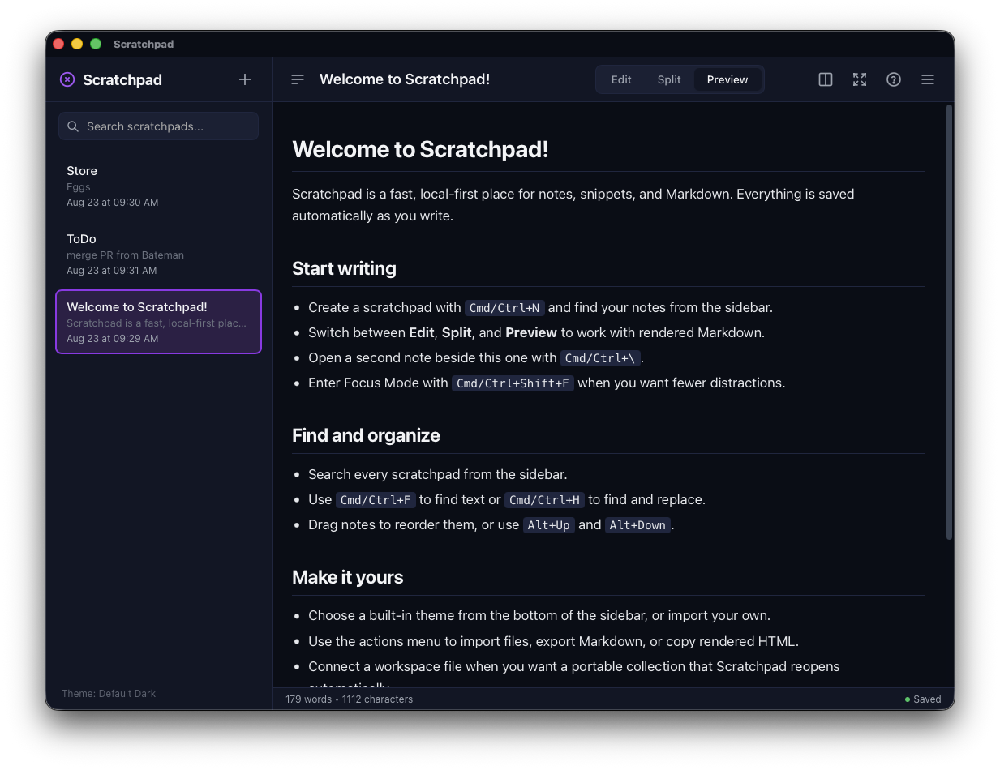

<p align="center">
  
</p>

# Scratchpad

[](https://github.com/crims0n/scratchpad/actions/workflows/ci.yml)
[](https://github.com/crims0n/scratchpad/releases)
[](LICENSE)

Scratchpad is a lightweight, open-source, local-first desktop editor for notes, snippets, and Markdown. It runs on macOS, Windows, and Linux with no account, cloud service, or telemetry.

## Install

Scratchpad is in beta. Download the newest prerelease from [GitHub Releases](https://github.com/crims0n/scratchpad/releases):

- **macOS:** open the `.dmg` and drag Scratchpad Beta to Applications.
- **Windows:** run the `.msi` or `.exe` installer.
- **Linux:** install the `.deb`, or make the `.AppImage` executable and run it.

Beta packages are not yet production-signed. macOS and Windows may show a security warning, so only install artifacts downloaded from this repository. Back up important workspace files before testing.

<p align="center">
  
</p>

## Features

- Multiple scratchpads with automatic saving and titles derived from the first line
- Edit, synchronized edit/preview, and full Markdown preview layouts
- Two-note side-by-side editing with drag-to-split
- Sidebar search, note reordering, word counts, and distraction-free Focus Mode
- Find and replace with regular-expression support and live highlighting
- Native text-file import and Markdown export
- Copy as Markdown or sanitized rendered HTML
- Optional portable workspace files that reopen automatically
- Built-in and importable color themes
- Keyboard shortcut reference and Markdown cheatsheet

## Storage and privacy

By default, notes stay in the desktop webview's local storage. Scratchpad also supports optional portable workspace files for a durable collection of notes and their sidebar order. Workspace files use SQLite internally and may have a `.db` or `.sqlite` extension.

Changes are mirrored locally and serialized to the connected workspace. Pending workspace changes are flushed before the desktop window closes; if that save fails, Scratchpad cancels the close and reports the error. Connecting an empty workspace seeds it with the notes already available in the app.

Scratchpad has no analytics, advertising, accounts, or sync service. Markdown is parsed on-device, preview HTML is sanitized, and remote images are blocked so merely previewing a note does not contact an image host. Following an ordinary web link is still an explicit network action and may contact that destination.

Back up important workspace files like any other local document. Local-only notes remain tied to the app data stored by the operating system and may be lost if that data is cleared.

## Keyboard shortcuts

The app displays `Cmd` on macOS and `Ctrl` on Windows or Linux.

| Shortcut | Action |
| --- | --- |
| `Cmd/Ctrl + N` | Create a scratchpad |
| `Cmd/Ctrl + B` | Toggle the sidebar |
| `Cmd/Ctrl + \` | Toggle two-note side-by-side editing |
| `Alt + ↑` / `Alt + ↓` | Move the active note in the sidebar |
| `Cmd/Ctrl + F` | Open or close Find |
| `Cmd/Ctrl + H` | Open Find and Replace |
| `Alt + R` | Toggle regular-expression mode while Find is open |
| `Enter` / `Shift + Enter` | Select the next or previous match |
| `Cmd/Ctrl + Shift + F` | Toggle Focus Mode |
| `Cmd/Ctrl + /` or `F1` | Open or close Help and Reference |
| `Tab` / `Shift + Tab` | Switch topics while Help is open |
| `Escape` | Close the active modal or Find bar, or leave Focus Mode |

## Themes

Scratchpad includes Default Dark and Light, Dracula, Catppuccin Mocha, Nord, Tokyo Night, Monokai Pro, One Dark Pro, Solarized Dark and Light, Amber CRT, Green CRT, Pastel Daydream, Macintosh System 6, Mac OS 9 Platinum, Windows Classic, and GitHub Dark.

A custom JSON theme requires `background` and `foreground`. Other colors receive defaults when omitted:

```json
{
  "name": "Amber CRT",
  "background": "#120f08",
  "foreground": "#f6c453",
  "sidebar": "#1b160b",
  "accent": "#ffb000",
  "border": "#4a3814",
  "selection": "#5c4315"
}
```

Simple TOML/key-value theme files using the same names are also accepted. Imported colors are validated before they are stored or rendered.

## Development

### Prerequisites

- Node.js 20 or newer
- Rust 1.98.0 (also declared in `rust-toolchain.toml`)
- The dependencies in the [Tauri prerequisites guide](https://tauri.app/start/prerequisites/)

### Run locally

```bash
git clone https://github.com/crims0n/scratchpad.git
cd scratchpad
npm install
npm run tauri -- dev
```

The frontend is served directly from `src/`; there is no framework-specific development server.

### Validate changes

```bash
npm run check
cargo fmt --manifest-path src-tauri/Cargo.toml --check
cargo clippy --manifest-path src-tauri/Cargo.toml --all-targets -- -D warnings
cargo test --manifest-path src-tauri/Cargo.toml
```

### Build locally

```bash
npm run tauri -- build
```

Bundles and installers are written beneath `src-tauri/target/release/bundle/`.

## Releases

The **CI** workflow validates every push to `main` and every pull request. The manually triggered **Beta Release** workflow validates the project, builds macOS, Windows, and Linux packages, and attaches them to a draft prerelease.

Before triggering a beta release, update the version in `package.json`, `src-tauri/Cargo.toml`, and `src-tauri/tauri.conf.json`. The validation command checks that all three match, and the workflow refuses to overwrite an existing release tag. Review the generated draft and its assets before publishing it.

Production distribution will also require platform signing and, on macOS, notarization credentials configured as repository secrets.

## Architecture

| Area | Implementation |
| --- | --- |
| Desktop runtime | Tauri v2 and Rust |
| Frontend | Vanilla HTML, CSS, and JavaScript |
| Markdown | Bundled Marked parser with an allowlist sanitizer |
| Local persistence | Desktop webview local storage |
| Workspace persistence | Bundled SQLite through `rusqlite` |
| Native preferences | JSON in the platform app configuration directory |
| Themes | CSS custom properties with JSON and TOML/key-value import |

## Contributing and security

See [CONTRIBUTING.md](CONTRIBUTING.md) for the development workflow. Please report suspected vulnerabilities privately using the process in [SECURITY.md](SECURITY.md).

## License

Scratchpad is free software licensed under [GPL-3.0-or-later](LICENSE). The bundled Marked parser is provided under the MIT License; see [THIRD_PARTY_NOTICES.md](THIRD_PARTY_NOTICES.md).
