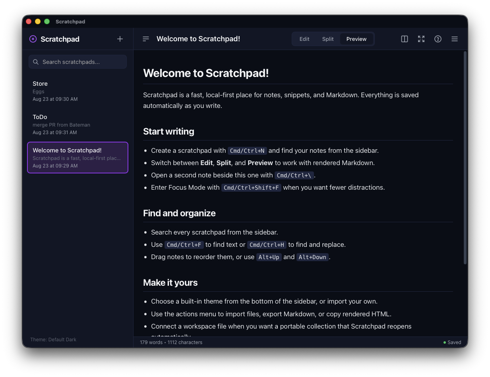

# Scratchpad

[](https://github.com/crims0n/scratchpad/actions/workflows/ci.yml)
[](https://github.com/crims0n/scratchpad/releases)
[](LICENSE)

Scratchpad is a lightweight, open-source, local-first desktop editor for notes, snippets, and Markdown. It runs on macOS, Windows, and Linux with no account, cloud service, or telemetry.

[Visit the Scratchpad website](https://crims0n.github.io/scratchpad/) for an OS-aware download and SHA-256 checksums.

<p align="center">
  
</p>

## Install

Scratchpad is in beta. Download the newest prerelease from the [Scratchpad website](https://crims0n.github.io/scratchpad/) or [GitHub Releases](https://github.com/crims0n/scratchpad/releases):

- **macOS:** open the `.dmg` and drag Scratchpad Beta to Applications.
- **Windows:** run the `.msi` or `.exe` installer.
- **Linux:** install the `.deb`, or make the `.AppImage` executable and run it.

Beta packages are not yet production-signed. macOS and Windows may show a security warning, so only install artifacts downloaded from this repository. Back up important workspace files before testing.

See [release notes](RELEASE_NOTES.md) for highlights, compatibility details, and beta caveats.

## Features

- Optional local MCP agent access with five read tools, eight individually enabled write tools, and a live listening indicator
- Optional update checks with in-app release notes, separate Beta and Stable channels, and automatic checks off by default

- Multiple scratchpads with automatic saving, titles derived from the first line, and quick creation by double-clicking empty sidebar space
- Edit, synchronized edit/preview, and full Markdown preview layouts
- Optional format-aware editor coloring for Markdown, JSON, XML, YAML, and CSV, plus language-aware fenced-code highlighting in previews
- Optional, theme-aware source line numbers in either editor pane
- Markdown-aware continuation for lists, task lists, blockquotes, code fences, and tables
- Pair completion, selection wrapping, and smart URL or spreadsheet paste
- Right-click Markdown starter templates for tables, task lists, code blocks, and links
- Two-note side-by-side editing with drag-to-split and live source comparison
- Top-level pinned notes, collapsible sidebar folders with drag-and-drop organization, search, configurable note previews, manual ordering, word counts, and distraction-free Focus Mode
- Find and replace with case-sensitive, exact-match, and regular-expression modes, live highlighting, and results across one or every scratchpad
- Sidebar format badges for detected TXT, MD, JSON, XML, YAML, and CSV content, refreshed after edits
- Native text-file import and Markdown/standalone HTML export
- Formatted, note-only printing through the system print dialog (Cmd/Ctrl+P)
- Copy as Markdown or sanitized rendered HTML
- Optional portable workspace files that reopen automatically
- Recoverable note deletion with persistent trash, Restore actions, and user-confirmed Empty Trash
- Built-in and importable color themes with contrast-aware sidebar and active-note tones
- Persistent editor zoom and adjustable editor line spacing
- A sectioned Scratchpad menu, About panel, keyboard shortcut reference, and Markdown cheatsheet

## Storage and privacy

By default, notes, folders, and trash stay in the desktop webview's local storage. Scratchpad also supports optional portable workspace files for a durable collection of notes, folders, trash, pinned state, and sidebar order. Workspace files use SQLite internally and may have a `.db` or `.sqlite` extension. Notes without a folder remain at the top level of the sidebar; deleting a folder from the sidebar returns its notes there rather than deleting them. Agent folder deletion requires an empty folder.

Local notes and workspace notes are two separate collections, each with its own trash. While a workspace is connected, changes are written to that workspace and the local collection is left exactly as it was, so disconnecting returns the notes and trash you had before. Connecting an empty workspace seeds it with the active notes and folders already available in the app; local trash stays local. A workspace with existing notes, folders, or trash opens its own collection.

A **collection** is your notes, folders, and trash; a **workspace file** is a portable storage location for a collection. The menu section is labeled **Collection** for local notes, or **Workspace** for a workspace file. Both modes use the same status label: **Current — Local notes** or **Current — filename**. Hover over actions for descriptions and their storage scope; the same information is available to screen readers. Choose **Open or create workspace…** to switch to a workspace file, or **Return to local notes** to switch back. These actions do not merge collections. Backup and restore remain available in both modes. **Clear Local Collection…** is hidden while a workspace is open and always targets local storage, never a workspace file.

Pending workspace changes are flushed before the desktop window closes; if that save fails, Scratchpad cancels the close and reports the error. If a workspace cannot be opened at start-up, Scratchpad reports it and falls back to your local notes, leaving the workspace file untouched.

Scratchpad has no analytics, advertising, accounts, or sync service. Markdown is parsed on-device, preview HTML is sanitized, and remote images are blocked so merely previewing a note does not contact an image host. Links in the preview open in your default browser rather than inside the app; following one is an explicit network action and may contact that destination.

Open **Scratchpad menu → About Scratchpad**, then choose **Check for Updates…** to check for a newer version on your installed release channel (Beta or Stable). About shows the installed version, channel, last check time, and any available update; its menu item indicates when an update is available. Choose **Read release notes** to review the changes inside the app before deciding; **Download Update** opens that version’s GitHub release page in your browser. **Later** closes the panel, and **Skip This Version** suppresses background notices for that version. Manual checks still reveal skipped releases. Scratchpad never installs updates automatically.

**Automatically check for updates**, in About, is off by default. Manual checks and enabled automatic checks request the public release manifest at `https://crims0n.github.io/scratchpad/release.json`. GitHub receives normal connection information such as your IP address, but no notes, workspace data, account identifiers, or telemetry. Automatic checks run after a short launch delay and at most once every 24 hours, including failed attempts; background failures do not interrupt editing. The preference, last attempt time, and skipped version are saved locally. Turning the preference off cancels future checks; a request already sent may finish.

The optional [MCP agent access](docs/mcp.md) uses a stdio mode built into the
desktop executable and is off by default. While enabled, it can read the collection open
in Scratchpad, including edits that have not been saved yet. Individually enabled
write functions can create notes and folders, append text, rename notes and
folders, move notes between folders, move notes to recoverable trash, and delete
empty folders. Agents can list trash metadata; restoring and permanently
emptying trash are available only in the UI. Existing-item edits require revision
checks and support safe retries. A connected agent
may send returned note contents to its model provider.

### Collection backup and restore

In the desktop app, choose **Back Up Collection…** from the menu to save the currently open local-only or workspace collection. Pending edits are saved first; a failed save or backup is reported without claiming success. The JSON file is staged, synced, and verified before replacing any existing backup file.

Choose **Restore Collection…**, select a backup, and review the destination and counts before confirming **Replace collection**. Restore replaces all active notes, folders, and trash in the current collection; it does not merge or affect other collections. Invalid, truncated, and unsupported backups are rejected before replacement. Editing, collection switching, MCP writes, and app closing are blocked while the dialog is open. Close any other Scratchpad instances using the same collection before backing up or restoring; the dialog does not lock other processes.

The version 1 format uses `kind: "scratchpad-collection-backup"`, `schemaVersion: 1`, an ISO `createdAt`, and a `collection` containing ordered `notes`, ordered `folders`, and `trash`. It preserves IDs, titles, bodies, timestamps, title locks, pins, folder assignments, empty folders, and deleted-note metadata. Preferences, themes, collapsed sections, workspace paths, MCP tokens/permissions, and earlier recovery archives are **not** included. A backup can be restored into either a local-only or workspace collection, including an empty or trash-only collection. Restoring a workspace keeps the same workspace file and connection.

Empty collections remain empty after reopening. With no note selected, the title and editor are read-only and a prompt explains how to create or select a note; creating/selecting one enables editing. No placeholder note is inserted automatically.

Before replacement, Scratchpad saves and verifies an independent, restorable safety backup in the app data directory's `collection-backups` folder and shows its path. Keep that file until you have checked your restored data; you can restore it through the same action to undo a replacement. Workspace replacement uses one SQLite transaction. Local replacement uses a durable native checkpoint: a failed or interrupted write rolls back to the prior local values, including on the next launch. If recovery cannot complete, local data remains read-only; **Retry reading** retries checkpoint recovery. Do not delete app data while recovery is pending. The safety copies are retained and have no automatic expiry.

Backups and safety copies are unencrypted and contain active **and trashed** note content; store them privately and copy important backups somewhere outside the app data directory. Clearing app data also deletes local notes and automatic safety copies. Collection backups are distinct from Markdown/HTML exports (one note) and preserved-data recovery exports (raw damaged data for manual recovery).

### HTML export

Choose **Scratchpad menu → Note → Export HTML file** to save the selected note as a standalone `.html` document. In Dual-Note Split View, it exports the active editor pane. The export includes your latest edits, Markdown formatting, the current preview colours, and code highlighting when enabled; it does not change your note or collection. Styles are embedded, with system font fallbacks, so the file opens offline without Scratchpad or external assets. Search highlights and app controls are excluded.

HTML export uses the same sanitization as Preview: scripts and unsafe links are removed, internet/local-file images are blocked, and supported embedded raster images are retained. Safe external links remain clickable and go online only when opened. The HTML file contains readable, unencrypted note content; store and share it accordingly. HTML exports are for reading/sharing, not collection backups or a round-trip import format. PDF export is not included.

### Printing a note

Choose **Scratchpad menu → Note → Print Note…**, or press **Cmd+P** on macOS / **Ctrl+P** on Windows and Linux. The desktop app opens a separate, note-only preview and its system print dialog, using a fresh snapshot of the selected note, including current edits; in Dual-Note Split View it uses the active pane. Only formatted note content is printed, not the sidebar, editor controls, other notes, search highlights, or preview toolbar. Printing uses a light, paper-friendly palette regardless of the app theme, with wrapped code blocks, table headers, and page-break guidance. The same Preview/HTML sanitization and image restrictions apply.

Use the system dialog for printers, paper, margins, page ranges, and any available print-to-PDF destination. Cancel leaves your notes unchanged. The desktop preview stays open so an asynchronous print operation retains its document; use **Print…** to retry, then **Close** when finished, before preparing another note. Its snapshot is kept only in memory and released when that window closes, with no temporary note file. Browser-only use prints an offscreen note document and removes it after the dialog closes. Scratchpad does not report printing as a successful save and cannot tell whether paper was actually printed. Printing/sharing can expose note content to your chosen printer or destination. A dedicated PDF export remains separate from this feature.

### Clearing the local collection

In the desktop app, while **Local notes** is active, choose **Clear Local Collection…**. Review the note, folder, and trash counts, then type the exact word **DELETE** to enable **Clear local collection**. Cancel or Escape leaves the collection unchanged; confirmation is discarded when the dialog closes. Return to local notes first if a workspace is connected. Recover unreadable local data or an interrupted collection change before clearing.

Clearing removes only the local notes, folders, and trash; it does not move notes to trash, reset preferences/themes, modify workspace files, or delete existing backup/recovery copies. Pending edits are saved and a verified, restorable safety backup is retained **before** clearing. A save or safety-backup failure stops the operation. Clearing uses the same durable checkpoint and rollback/startup recovery as local restore. Empty collections stay empty across restart; create or select a note before editing.

The result shows the safety backup path. Use **Restore Collection…** to restore it into local notes if needed. Safety copies are unencrypted, include trashed content, and have no automatic expiry. This action is **not secure erasure** and is not a full app-data reset. Close other instances using the local collection first; it does not lock other processes. Copy important backups outside the app data directory.

## Agent access (MCP)

Open **Scratchpad menu → Agent access** and turn access **On**. Choose **MCP Configuration** to copy the executable path, `--mcp-stdio` argument, or generic JSON example into a client that supports local stdio MCP servers. Configuration stays available while access is off. Scratchpad must remain open; the accent-colored **MCP listening** indicator appears beside the save status while access is enabled.

Each time access starts, all five read permissions are on and all eight write permissions are off. Use the **Read** and **Write** checkboxes to choose individual functions or select all in a section. Changes apply to connected clients immediately and reset when access is restarted.

| Permission group | Functions |
| --- | --- |
| Read | List folders, list notes, search notes, read note content, list trash metadata |
| Write | Create note, create folder, append to note, rename note, move note, rename folder, delete note to trash, delete empty folder |

Writes to existing items check the current revision before changing anything. Request IDs make retries safe after a timeout or failed save. Agents cannot replace an entire note, read trashed note bodies, restore notes, or empty trash. Access applies to all connected local clients and to the collection currently open in Scratchpad, including unsaved edits.

See the [MCP reference](docs/mcp.md) for client setup, tool arguments, limits, retry behavior, and the privacy boundary.

## Delete and recover notes

Use a note's sidebar delete button or right-click it and choose **Delete Note** to move it to trash. Click the **trash icon at the bottom right** to see deleted notes and choose **Restore**. Restoring preserves the note's content, title, and pin state, returning it to its original folder or the top level if that folder no longer exists.

Right-click the trash icon and choose **Empty Trash…**, then confirm to permanently remove the listed recovery copies. Keyboard users can focus the icon and press `Shift+F10` to open its menu. Trash survives restarts and has no automatic expiry. Only the user can restore notes or empty trash; MCP agents can list its metadata. See [storage and recovery details](docs/mcp.md#deleting-and-recovering-notes) for save-failure behavior.

If saved local notes or folder metadata cannot be read, a **Local data recovery** banner keeps that collection read-only. Startup, autosave, MCP writes, switching collections, and closing the app do not replace the unreadable values. Readable notes can still be viewed and copied, and healthy workspace files remain usable.

Choose **Export preserved data…** to save a recovery JSON bundle containing the current unreadable raw strings, including malformed JSON, and all preserved recovery files. Each preserved file is included as its original JSON string; previous copies are not nested inside new snapshots. This is for manual recovery, not a collection backup or a file the Markdown importer can restore. The bundle can include active and trashed note content; keep it private. **Retry reading** reloads the original local values without changing them.

In the desktop app, **Replace unreadable data…** requires confirmation and first saves and verifies an independent recovery file in the app data directory's `local-recovery` folder, outside the webview's localStorage quota. Only then does it replace unreadable notes or folder metadata with empty values. Readable data and trash are retained. A failed archive write prevents replacement; if a later replacement write fails, the original file remains available. Earlier localStorage recovery copies are preserved in that file before being removed from localStorage. Export for safekeeping before proceeding: deleting the app data directory also deletes these recovery files. The banner keeps all finalized copies available to export after replacement and future launches. Browser-only sessions can export but cannot automatically replace unreadable data. Missing folder metadata may need manual reconstruction; this action does not repair damaged JSON automatically.

## Keyboard shortcuts

The app displays `Cmd` on macOS and `Ctrl` on Windows or Linux.

| Shortcut | Action |
| --- | --- |
| `Cmd/Ctrl + N` | Create a scratchpad |
| `Cmd/Ctrl + B` | Toggle the sidebar |
| `Cmd/Ctrl + \` | Toggle two-note side-by-side editing |
| `Alt + ↑` / `Alt + ↓` | Move a list branch, or the active sidebar note outside a list |
| `Cmd/Ctrl + F` | Open or close Find |
| `Cmd/Ctrl + H` | Open Find and Replace |
| `Alt + C` | Toggle case-sensitive matching while Find is open |
| `Alt + W` | Toggle exact whole-word matching while Find is open |
| `Alt + R` | Toggle regular-expression mode while Find is open |
| `Enter` / `Shift + Enter` | Select the next or previous match |
| `Enter` | Continue a list or blockquote, close a new code fence, or extend a table |
| `Tab` / `Shift + Tab` | Nest or outdent a list, navigate table cells, or insert plain indentation |
| `Home` | Move to list-item content first, then the beginning of the line |
| `Cmd/Ctrl + +` / `Cmd/Ctrl + -` | Zoom the editor in or out |
| `Cmd/Ctrl + 0` | Reset editor zoom to 100% |
| `Cmd/Ctrl + Shift + F` | Toggle Focus Mode |
| `Cmd/Ctrl + /` or `F1` | Open or close Help and Reference |
| `Tab` / `Shift + Tab` | Switch topics while Help is open |
| `Escape` | Close the active modal or Find bar, or leave Focus Mode |

## Markdown editing

Scratchpad keeps its Markdown assistance lightweight and works directly in the native text editor:

- `Enter` preserves the marker and spacing of bullet lists, advances ordered-list numbering, and creates unchecked task items. An empty item outdents or exits its list.
- `Tab` at the start of a list item nests the complete item and its children; `Shift+Tab` outdents them. Elsewhere, Tab inserts indentation. Fenced code always receives literal indentation.
- Blockquotes continue at the same depth. Starting a fenced code block closes the fence and leaves the cursor between the markers.
- Parentheses, brackets, braces, quotes, and inline backticks pair automatically. Typing an existing closing character advances past it, and Backspace removes an empty pair. Selecting text before typing `*`, `_`, <code>`</code>, or `~` wraps the selection.
- Finishing a table header creates its separator and first row. `Enter` in the final cell or `Tab` past it adds a row; `Enter` or Backspace on an empty generated row exits the table.
- Pasting a URL over selected text makes a Markdown link. Pasting a rectangular tab-separated spreadsheet range makes a Markdown table; ragged or uniformly indented tab-separated text stays literal.
- Right-click in either editor and choose **Insert** for a starter table, task list, fenced code block, inline link, or reference-style link. The first useful placeholder is selected so typing replaces it immediately.

Syntax highlighting is enabled by default. Open **Scratchpad menu → Appearance → Syntax highlighting** to toggle coloring in both editor panes and language-aware Preview highlighting. Editor colors follow the detected sidebar format: Markdown syntax, JSON keys and values, XML tags and attributes, YAML keys and values, and repeating CSV column colors. TXT stays plain; incomplete or unrecognized documents stay plain until a format is detected. Preview code highlighting requires a supported language after the opening fence, such as <code>```javascript</code>; unknown and unlabeled fences remain plain code.

Source line numbers are off by default. Open **Scratchpad menu → Appearance → Line numbers** to show a subtle, theme-aware gutter in both editor panes; the preference is remembered between launches.

Open two notes side by side, then choose **Compare** in the toolbar to highlight source differences without changing either note. Removed text is marked on the left, added text on the right, and related words receive contiguous substring detail. The toolbar reports the total number of changed lines across both notes. Comparison refreshes after a brief pause in typing, showing **Updating comparison…** while pending, and turns off when split view closes.

## Themes

Scratchpad includes Default Dark and Light, Dracula, Catppuccin Mocha, Nord, Tokyo Night, Monokai Pro, One Dark Pro, Solarized Dark and Light, Amber CRT, Green CRT, Pastel Daydream, Macintosh System 6, Mac OS 9 Platinum, Windows Classic, and GitHub Dark.

A custom JSON theme requires `background` and `foreground`. Other colors receive defaults when omitted:

```json
{
  "name": "Amber CRT",
  "background": "#120f08",
  "foreground": "#f6c453",
  "sidebar": "#1b160b",
  "accent": "#ffb000",
  "border": "#4a3814",
  "selection": "#5c4315"
}
```

Simple TOML/key-value theme files using the same names are also accepted. Imported colors are validated before they are stored or rendered. Opaque hex, RGB, HSL, named, and `color(srgb …)` values are measured against the theme's own surfaces so secondary text remains readable; translucent or wider-gamut values are preserved without being flattened into guessed colors.

## Development

### Prerequisites

- Node.js 20 or newer
- Rust 1.98.0 (also declared in `rust-toolchain.toml`)
- The dependencies in the [Tauri prerequisites guide](https://tauri.app/start/prerequisites/)

### Run locally

```bash
git clone https://github.com/crims0n/scratchpad.git
cd scratchpad
npm install
npm run tauri -- dev
```

The frontend is served directly from `src/`; there is no framework-specific development server.

### Validate changes

```bash
npm run check
cargo fmt --manifest-path src-tauri/Cargo.toml --check
cargo clippy --manifest-path src-tauri/Cargo.toml --all-targets -- -D warnings
cargo test --manifest-path src-tauri/Cargo.toml
```

### Build locally

```bash
npm run tauri -- build
```

Bundles and installers are written beneath `src-tauri/target/release/bundle/`.

## Releases

The **CI** workflow validates every push to `main` and every pull request. The manually triggered **Beta Release** workflow validates the project, builds macOS, Windows, and Linux packages, and attaches them to a draft prerelease.

Before triggering a beta release, update the version in `package.json`, `src-tauri/Cargo.toml`, `src-tauri/tauri.conf.json`, both lockfiles, and the About panel in `src/index.html`. Update `RELEASE_NOTES.md`, the README, MCP reference, welcome note, and in-app Help for the final feature set. The validation command checks version consistency, and the workflow refuses to overwrite an existing release tag. Review the generated draft and its assets before publishing it. The website's download manifest is generated from published GitHub releases; do not point it at unbuilt packages.

Production distribution will also require platform signing and, on macOS, notarization credentials configured as repository secrets.

## Architecture

| Area | Implementation |
| --- | --- |
| Desktop runtime | Tauri v2 and Rust |
| Frontend | Vanilla HTML, CSS, and JavaScript |
| Editor | Offline-bundled CodeMirror 6 behind a note-editor adapter; selection, undo, wrapping, and gutters in both panes |
| Markdown | Bundled Marked parser with an allowlist sanitizer |
| Syntax highlighting | Bundled Highlight.js for JSON/XML/YAML editors and labeled preview fences; local Markdown and CSV tokenizers |
| Note comparison | Bundled jsdiff with line and word-level source comparison |
| External links | `tauri-plugin-opener`, scoped to `http`, `https`, and `mailto` |
| Local persistence | Desktop webview local storage |
| Workspace persistence | Bundled SQLite through `rusqlite` |
| Agent integration | Toggleable stdio MCP access in the desktop binary through the official Rust MCP SDK |
| Native preferences | JSON in the platform app configuration directory |
| Themes | CSS custom properties with JSON and TOML/key-value import |

## Contributing and security

See [CONTRIBUTING.md](CONTRIBUTING.md) for the development workflow. Please report suspected vulnerabilities privately using the process in [SECURITY.md](SECURITY.md).

## License

Scratchpad is free software licensed under [GPL-3.0-or-later](LICENSE). The bundled CodeMirror editor and Marked parser are provided under the MIT License; Highlight.js and jsdiff are provided under the BSD 3-Clause License. See [THIRD_PARTY_NOTICES.md](THIRD_PARTY_NOTICES.md).
